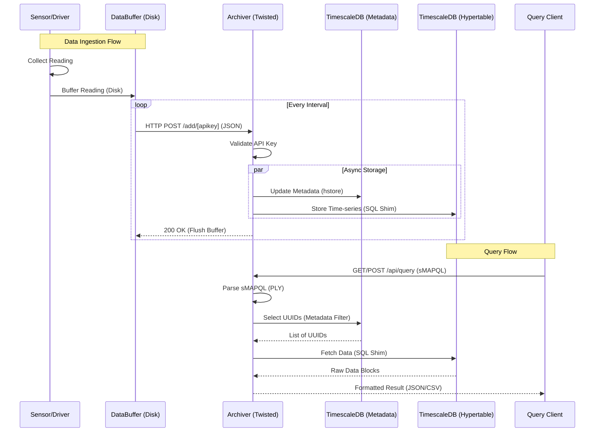

# sMAP Architecture Documentation

This document provides a comprehensive architectural overview of the sMAP (Simple Measurement and Actuation Profile) system based on the underlying codebase. It details the core components, inter-component communication, overall data flow, query handling mechanisms, and data ingestion processes.
## System Architecture Diagrams

### High-Level Overview


*Figure 1: The sMAP architecture consisting of Sources, Archivers, and Applications.*

### Archiver Internals


*Figure 2: The archiver service connecting to Postgres and ReadingDB.*

### Data Organization


*Figure 3: sMAP organizes data as time series objects within collections.*

## System Flow (Mermaid)

```mermaid
graph TD
...
    subgraph "External World"
        Sensors[Sensors/Devices]
        Actuators[Actuators]
    end

    subgraph "sMAP Source (Driver)"
        DriverLogic[Driver Logic]
        Collection[Collection Hierarchy]
        Reporting[Reporting & Disk Buffer]
    end

    subgraph "sMAP Archiver"
        Ingestion[/add Endpoint]
        QueryAPI[/api/query Endpoint]
        Republisher[Republisher]
    end

    subgraph "Storage Layer (TimescaleDB)"
        Postgres[(Postgres: Metadata)]
        Hypertable[(TimescaleDB: Hypertable)]
    end

    subgraph "Clients"
        QueryClient[Query Client]
        Subscriber[Real-time Subscriber]
    end

    %% Data Flow
    Sensors -->|Data| DriverLogic
    DriverLogic --> Collection
    Collection --> Reporting
    Reporting -->|HTTP POST| Ingestion

    %% Ingestion Flow
    Ingestion --> Postgres
    Ingestion --> Hypertable
    Ingestion --> Republisher
    Republisher -->|WebSockets/Long-poll| Subscriber

    %% Query Flow
    QueryClient -->|sMAPQL| QueryAPI
    QueryAPI --> Postgres
    QueryAPI --> Hypertable
    QueryAPI -->|JSON/CSV| QueryClient

    %% Actuation Flow
    QueryClient -.->|Actuation| DriverLogic
    DriverLogic -.-> Actuators
```

## 1. Core Components

The sMAP architecture consists of several main components that work together to organize and distribute time-series data:

*   **sMAP Source (Driver)**: The primary entry point for data. It is an application that interfaces with external systems, sensors, or actuators to collect data. Internally, data is represented as `Timeseries` objects arranged within a `Collection` hierarchy (`python/smap/core.py`, `python/smap/driver.py`).
*   **Archiver**: A central service responsible for aggregating data from multiple sMAP sources. It manages long-term storage and provides an API equipped with a specific query language (sMAPQL) for data retrieval (`python/smap/archiver/server.py`).
*   **ReadingDB (SQL Shim)**: In this modernized architecture, the legacy C++ `readingdb` server has been replaced by a Python-based SQL shim (`python/readingdb.py`). This shim implements the `readingdb` API but translates calls directly into SQL queries executed against TimescaleDB.
*   **TimescaleDB (PostgreSQL)**: The primary storage backend. It leverages the TimescaleDB extension for PostgreSQL to provide high-performance time-series storage. 
    *   **Metadata**: Stored in a standard PostgreSQL table (typically `stream`) using the `hstore` extension for flexible key-value tagging.
    *   **Readings**: Stored in a TimescaleDB **hypertable** (typically `data`), which provides automatic partitioning and optimized indexing for time-series data.

## 2. Database Schema

The sMAP Archiver uses a unified PostgreSQL/TimescaleDB database to store both system state and time-series data.

### Core Tables

| Table | Purpose | Key Columns |
| :--- | :--- | :--- |
| `subscription` | Stores sMAP source registrations and associated API keys. | `id`, `uuid`, `key` (API Key), `url` |
| `stream` | Maps unique sMAP UUIDs to internal numeric IDs and stores metadata. | `id`, `uuid`, `subscription_id`, `metadata` (HSTORE) |
| `data` | **TimescaleDB Hypertable.** Stores the actual time-series readings. | `sid` (ref: `stream.id`), `time` (ms), `value` (double) |

### Metadata Storage (`hstore`)
sMAP utilizes the PostgreSQL `hstore` extension in the `stream` table to allow for arbitrary key-value pairs to be attached to any stream. This enables the flexible tagging system required for sMAPQL queries.

### Access Control and Permissions

| Table | Purpose |
| :--- | :--- |
| `permission` | Defines specific access rights (can_select, can_delete, can_set) for API keys. |
| `permission_subscriptions` | Maps specific permissions to the subscriptions they are allowed to access. |

### Internal Mechanisms

| Table | Purpose |
| :--- | :--- |
| `republish` | A temporary buffer used to track data points that need to be pushed to real-time subscribers. |

## 3. Communication and Frameworks

sMAP heavily leverages asynchronous paradigms to handle high concurrency and data streaming:

### Data Ingestion & Query Sequence (UML)



*   **Twisted Framework**: The backbone of the sMAP ecosystem. The entire system uses the Twisted event loop for scheduling tasks, `twisted.web` for providing web server functionalities, and asynchronous database interfaces (like `adbapi`) to interact with PostgreSQL/TimescaleDB without blocking.
*   **REST API**: Inter-component communication primarily relies on JSON over HTTP. sMAP Sources expose their internal representations (the Collection hierarchy) via a REST API. For example, a source's `/data` endpoint can be accessed to view current readings. The Archiver exposes its interface via an API server under `/api/query`.
*   **Data Reporting (Ingestion)**: Sources utilize a dedicated `Reporting` mechanism (`python/smap/reporting.py`) to periodically and reliably POST buffered data to the Archiver's `/add` endpoint.
*   **Real-time Republishing**: The Archiver incorporates a republisher component (`python/smap/archiver/republisher.py`) capable of pushing live, incoming data to registered subscribers using WebSockets or HTTP long-polling.

## 3. Overall Data Flow

The lifecycle of a single measurement in sMAP typically follows this flow:

1.  **Collection**: A driver acquires a measurement from a sensor or external system and calls `Timeseries.add(value)` to insert it into the driver's internal state.
2.  **Buffering**: The `Reporting` instance embedded within the sMAP Source application captures this addition and appends the data point to a local, disk-backed circular buffer (`DataBuffer`). This ensures data is not lost during temporary network outages.
3.  **Transmission**: On a configured interval, the `Reporting` service initiates an HTTP POST request, transmitting the buffered data payload to the target Archiver's `/add/[apikey]` endpoint.
4.  **Ingestion & Distribution**: The Archiver receives the POST request. It validates the API key, immediately republishes the incoming data to any real-time subscribers, and then schedules writes to its persistent storage backends (PostgreSQL for metadata, TimescaleDB Hypertable for time-series).

## 4. How sMAP Handles Queries

When a client queries the system for data or metadata, the process spans parsing to database execution:

1.  **Parsing**: A client sends a query to the Archiver's `/api/query` endpoint (`python/smap/archiver/api.py`). The query is routed to the `QueryParser` (`python/smap/archiver/queryparse.py`), which uses the PLY (Python Lex-Yacc) library to parse the custom sMAPQL syntax.
2.  **Selection (Metadata)**: The parsed query is translated into SQL statements. These statements query the PostgreSQL `stream` table (often leveraging `hstore` queries) to identify the specific `stream_id`s that match the requested metadata filters.
3.  **Retrieval (Time-series)**: For queries requesting actual readings, the `DataRequester` (`python/smap/archiver/data.py`) takes the identified `stream_id`s and calls the `db_query` function in the SQL shim (`python/readingdb.py`) to fetch the corresponding time-series data blocks from the TimescaleDB hypertable.
4.  **Formatting and Response**: The retrieved raw data and metadata are assembled, formatted into the requested output format (typically JSON or CSV), and returned to the client as the HTTP response payload.

## 5. How sMAP Handles Data Addition (Ingestion)

Data ingestion is optimized for reliability and high throughput:

1.  **Source-side Reliability**: Data originates at the drivers. The `python/smap/reporting.py` module ensures that when drivers generate data, it is safely stored in a local, disk-backed queue.
2.  **Batch Delivery**: Rather than sending each point individually, `Reporting` batches points and sends them via HTTP POST to the Archiver. If the transmission fails, the data remains in the local buffer to be retried later.
3.  **Archiver Ingestion Pipeline**: Upon reaching `python/smap/archiver/server.py`, the incoming batch is parsed.
    *   Metadata associated with the incoming data streams is written to the PostgreSQL database to ensure the catalog is up-to-date.
    *   The time-series values are relayed to the `db_add` function within the SQL shim (`python/readingdb.py`), which persists the arrays of timestamps and values to the **TimescaleDB hypertable**.
    *   Concurrently, the data is passed to the real-time Republishing layer to update any active subscribers listening for new values on those streams.